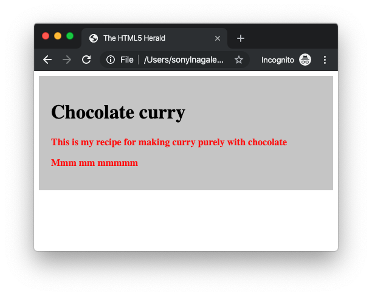

|  | <h1>Instructional Designer Assessment</h1> |
|---|---|


# Introduction

Your HTML5/CSS3 subject matter expert (SME) has delivered to you this wealth of information:

> Hello! Here is my material for the second lesson, showing how to tie HTML and CSS together. I have a braindump here, so I'm hoping the information is enough to craft into a lesson.

> Many thanks!

> Pat

Your task is to take Pat's material, as shown below, and organize it into a lesson to teach the marriage of HTML and CSS.

# Preconditions

1. The students have already been exposed to instruction on the basics of HTML.
1. The next task for the students is to understand how CSS fits in the ecosystem and tie it with the existing HTML they created in Lesson 1 and weave a coherent narrative for this section.

# Deliverables

At the end of this exercise, you will deliver either by GitHub repository or GitHub Gist a lesson plan for this material. The goal is for the lesson to be 30 minutes, but if you feel additional time is necessary, please feel free to outline your thoughts.

This lesson plan will include:

1. Learning Objectives and checkpoints.
1. A block-by-block breakdown of instruction, _e.g._ 0-5mins Topic x ; 5-15mins Topic y.
1. Clear headers and content material for an instructor to follow. This material will be written like a script, but will not be intended to be read verbatim. Use your judgement here on how to present this material for a live teaching scenario.
1. Use the best practices of [Markdown](https://www.markdownguide.org/cheat-sheet/) when writing this plan.
1. Consider rewriting parts of the SME's work into your own words. It's possible Pat may have copied segments directly from other resources. For the purposes of this exercise, use your judgement on how to rewrite and rephrase the content because parts of the content are directly lifted from other online resources.

# Material - Begin Here

## HTML5 Boilerplate

As we learned, we can find a standard HTML5 template for oursleves to eliminate the need to start from scratch each time. As you learn HTML5 and add new techniques to your toolbox, you’re likely going to want to build yourself a boilerplate from which you can begin all your HTML5-based projects. We encourage this, and you may also consider using one of the many online sources that provide a basic HTML5 starting point for you.

Let’s start simple, with a bare-bones HTML5 page:

```HTML
<!doctype html>

<html lang="en">
<head>
  <meta charset="utf-8">

  <title>The HTML5 Herald</title>
  <meta name="description" content="The HTML5 Herald">
  <meta name="author" content="SitePoint">

  <link rel="stylesheet" href="styles.css">

</head>

<body>
  <h1>Welcoime!</h1>
</body>
</html>
```

### Doctype

It's simple, and to the point. The doctype can be written in uppercase, lowercase, or mixed case. You’ll notice that the “5” is conspicuously missing from the declaration. Although the current iteration of web markup is known as “HTML5,” it really is just an evolution of previous HTML standards — and future specifications will simply be a development of what we have today.

Because browsers are usually required to support all existing content on the Web, there’s no reliance on the doctype to tell them which features should be supported in a given document. In other words, the doctype alone is not going to make your pages HTML5-compliant. It’s really up to the browser to do this. In fact, you can use one of those two older doctypes with new HTML5 elements on the page and the page will render the same as it would if you used the new doctype.

### HTML Element

Next up in any HTML document is the html element, which has not changed significantly with HTML5. In our example, we’ve included the lang attribute with a value of en, which specifies that the document is in English. In XHTML-based syntax, you’d be required to include an xmlns attribute. In HTML5, this is no longer needed, and even the lang attribute is unnecessary for the document to validate or function correctly.

## CSS

We also need a CSS link for our styles! Maybe we have the following CSS:

```CSS
header,footer,
article,section,
hgroup,nav,
figure{
    /* Giving a display value to the HTML5 rendered elements: */
    display:block;
}

article .line{
    /* The dividing line inside of the article is darker: */
    background-color:#15242a;
    border-bottom-color:#204656;
    margin:1.3em 0;
}

footer .line{
    margin:2em 0;
}

nav{
    background:url(img/gradient_light.jpg) repeat-x 50% 50% #f8f8f8;
    padding:0 5px;
    position:absolute;
    right:0;
    top:4em;

    border:1px solid #FCFCFC;

    -moz-box-shadow:0 1px 1px #333333;
    -webkit-box-shadow:0 1px 1px #333333;
    box-shadow:0 1px 1px #333333;
}

nav ul li{
    display:inline;
}

nav ul li a,
nav ul li a:visited{
    color:#565656;
    display:block;
    float:left;
    font-size:1.25em;
    font-weight:bold;
    margin:5px 2px;
    padding:7px 10px 4px;
    text-shadow:0 1px 1px white;
    text-transform:uppercase;
}

nav ul li a:hover{
    text-decoration:none;
    background-color:#f0f0f0;
}

nav, article, nav ul li a,figure{
    /* Applying CSS3 rounded corners: */
    -moz-border-radius:10px;
    -webkit-border-radius:10px;
    border-radius:10px;
}
```

Now, how can we marry the content and the styles? In come **classes** and **ids**.

#### Selectors

In the CSS, a class selector is a name preceded by a full stop (“.”) and an ID selector is a name preceded by a hash character (“#”).

So the CSS might look something like:

```CSS
#top {
    background-color: #ccc;
    padding: 20px
}

.intro {
    color: red;
    font-weight: bold;
}
```

The HTML refers to the CSS by using the attributes id and class. It could look something like this:


```HTML
<div id="top">

<h1>Chocolate curry</h1>

<p class="intro">This is my recipe for making curry purely with chocolate</p>

<p class="intro">Mmm mm mmmmm</p>

</div>
```

The difference between an ID and a class is that an ID can be used to identify one element, whereas a class can be used to identify more than one.

You can also apply a selector to a specific HTML element by simply stating the HTML selector first, so `p.jam { /* whatever */ }` will only be applied to **paragraph** elements that have the class “jam”.

### Checkpoint

Do you see this?


