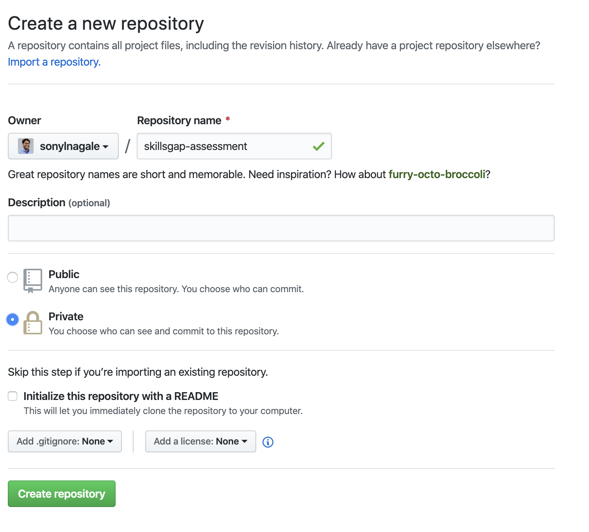

|  | <h1>Instructional Designer Assessment Submission Instructions</h1> |
|---|---|

For this exercise, it is expected that you have (or are willing to learn!) the basics of using GitHub, as it will be how we work with content in a versioned, controlled manner.

1. If you don't already have a GitHub account, sign up at [github.com](https://github.com). You can choose the free plan.
1. From the root path of this repository, click the green button to download a `.zip` of the material. (If you're familiar with git and GitHub, there's a reason why we're not cloning or forking—stay tuned.)
1. Create your lesson plan as **LESSON-PLAN-<yournamehere>.md**.

Now here comes the hard part...

1. On the GitHub website, click the green "New" button from the "My Repositories" page from your profile. You can find this by clicking your avatar in the upper-right corner and selecting "Your Repositories" from the menu.
1. Name your repository `skillsgap-assessment` and be sure to select "Private" for the repository:

    
1. Upload your material. If you're not familiar with GitHub, you can use the [GitHub Desktop Client](https://desktop.github.com/) for ease of use.
1. In the GitHub web interface in your repository, navigate to `Settings->Collaborators`. Add the GitHub username referenced in your assessment welcome email.
1. Send an email to the person addressed in the welcome email and paste the link to your private repository.

If you have any problems with GitHub, there is a wealth of information online about how to use it. Remember: make your repository _private_ so that no one can view your work other than the Skills Gap team.

Best of luck!
